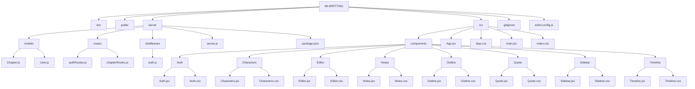

# I'm Writting!

## Introducción

I'm Writting! es una aplicación web pensada para escritores, estudiantes de narrativa o simplemente gente que necesita un espacio cómodo donde organizar ideas y escribir historias. La intención del proyecto era crear una herramienta de organización o pequeño escritorio virtual donde los usuarios tendrán organizados los personajes, capítulos y notas como si de un cuaderno se tratara.

Esperamos que con I'm Writting te cueste menos desarrollar esas pequeñas ideas que rondan tu cabeza y te animes a dar forma a tu primera obra narrativa.

---


## Tecnologías Utilizadas

### Frontend

- React
- JavaScript
- CSS
- Vite

### Backend

- Node.js
- Express
- MongoDB Atlas
- Mongoose

### Autenticación

- JWT (JSON Web Token)
- bcrypt

### Otras herramientas

- Git
- GitHub
- APIs REST
- Fetch API

---

## Arquitectura del Proyecto

I'm Writting se creó inicialmente como una app de escritorio ya que entendemos que la mayor parte del tiempo se utilizará en pc y no en dispositivos móviles.

La aplicación está dividida en frontend y backend separados.

El frontend se encarga de toda la parte visual y de interacción con el usuario. 
Se ha determinado un aspecto muy sobrio para que nada distraiga del obetivo principal que es la escritura.
React controla el renderizado de capítulos, el editor, las distintas vistas de navegación y la comunicación con el servidor mediante peticiones fetch.

La estructura principal se desgrana en varios componentes como App, Sidebar, Outline y Editor. El componente Outline gestiona toda la lógica de capítulos mientras que Editor se encarga del corazón de la app que es realmente lo más básico, de escritura. También existen componentes independientes para Timeline, Characters, Notes y Auth.

Por otro lado, el backend se encarga de toda la lógica relacionada con autenticación, protección de rutas y persistencia de datos. Express actúa como servidor principal y MongoDB almacena usuarios y capítulos.



---

## Funcionalidades Implementadas

La aplicación actualmente permite a los usuarios registrarse, iniciar sesión y mantener la sesión activa mediante tokens JWT almacenados en localStorage.

Entre las funcionalidades implementadas destacan:

- Creación de capítulos y eliminación de capítulos.
- Selección de capítulos activos para seguir los que has empezado. Son independientes, no necesitas acabar uno para empezar otro.
- Editor de escritura.
- Sistema de autenticación donde varios usuarios tendrán guardadas sus propias obras.
- Contador de palabras muy útil para trabajos o exposiciones de clase.
- Sistema rápido de notas en una sidebar propia para tenerlas a mano mientras se escribe.
- Timeline visual para ordenar los eventos de una historia o para organizar temas.
- Gestión de personajes con sus nombres, roles, etc.
- Integración con una API externa de frases de escritores para inspirarte o curiosear si te aburres.

Cada capítulo queda asociado al usuario autenticado y almacenado en la base de datos.

---

## Base de Datos

La aplicación utiliza MongoDB Atlas como sistema de persistencia de datos.

Existen principalmente dos colecciones: Users y Chapters.

---

## Futuras Mejoras

Aunque la aplicación ya es funcional, hay muchas ideas que podrían implementarse en el futuro:

- Autosave.
- Editor de texto más potente con selección de tipografía, subrayados y negrita.
- Personalización del escritorio.
- Notas que imiten post-it.
- Timeline más viual e intuitiva.


---

## Instalación y Ejecución

Primero hay que clonar el repositorio:

```bash
git clone <URL_DEL_REPO>
```

Entrar en la carpeta del proyecto:

```bash
cd im-writting
```

---

# Instalar dependencias

## Frontend

Desde la carpeta principal:

```bash
npm install
```

## Backend

Entrar en la carpeta server:

```bash
cd server
npm install
```

---

# Variables de entorno

Crear un archivo `.env` dentro de `server/` y añadir:

```env
MONGO_URI=tu_uri_mongodb
JWT_SECRET=tu_secret
```

---

# Configurar MongoDB Atlas

- Crear un cluster en MongoDB Atlas
- Crear usuario y contraseña
- Permitir acceso IP (`0.0.0.0/0`)
- Copiar la URI de conexión en el `.env`

---

# Ejecutar el proyecto

## Backend

Desde `server/`:

```bash
npm run dev
```

Servidor:

```txt
http://localhost:5000
```

---

## Frontend

Desde la carpeta principal:

```bash
npm run dev
```

